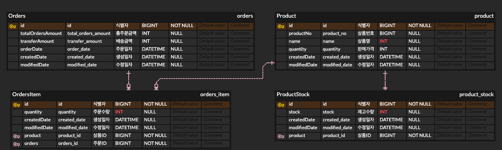
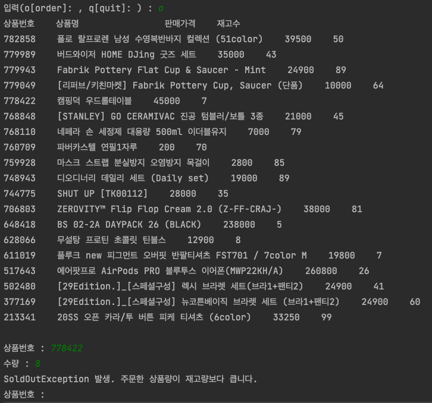
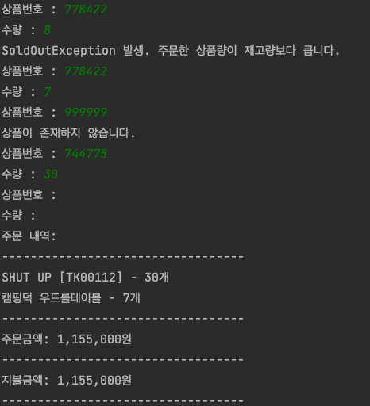
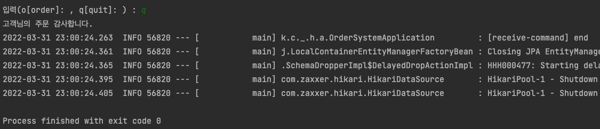

# 상품 주문 프로그램 

## Description
1. 29CM의 상품을 기반으로 한 상품 주문 콘솔 프로그램
2. Multi Thread 테스트, ControllerAdvice를 통한 예외 처리, 간단한 상품 주문 기능 구현

 

## 목차
1. [개발환경](#개발환경)
2. [프로젝트 구조](#프로젝트-구조)
3. [구현 방향](#구현-방향)
4. [구현 결과](#구현-결과)
5. [검증 결과](#검증-결과)

 

## 개발환경
1. Framework : Spring Boot 
2. Language : Java 8  
3. Project SDK : 1.8  
4. IDE : IntelliJ  
5. Build : Gradle 7.4.1  
6. Library : Lombok, Opencsv, JUnit  

 

## 프로젝트 구조
### File Tree
    ├── READ.md  
    ├── build.gradle  
    ├── csv  
    │   └── product_items.csv  
    ├── gradle  
    │   └── wrapper  
    │       ├── gradle-wrapper.jar  
    │       └── gradle-wrapper.properties  
    ├── gradlew  
    ├── gradlew.bat  
    ├── settings.gradle  
    └── src  
    ├── main  
    │   ├── generated  
    │   ├── java  
    │   │   └── com  
    │   │       └── kingpiggy  
    │   │           └── study  
    │   │               └── productordersystem  
    │   │                   ├── Application.java  
    │   │                   ├── application  
    │   │                   │   └── OrderSystemApplication.java  
    │   │                   ├── data  
    │   │                   │   ├── enumclass  
    │   │                   │   │   └── ErrorCode.java  
    │   │                   │   └── vo  
    │   │                   │       └── ProductVO.java  
    │   │                   ├── domain  
    │   │                   │   ├── BaseTimeEntity.java  
    │   │                   │   ├── entity  
    │   │                   │   │   ├── Orders.java  
    │   │                   │   │   ├── OrdersItem.java  
    │   │                   │   │   ├── Product.java  
    │   │                   │   │   └── ProductStock.java  
    │   │                   │   └── repository  
    │   │                   │       ├── OrdersItemRepository.java  
    │   │                   │       ├── OrdersRepository.java  
    │   │                   │       ├── ProductRepository.java  
    │   │                   │       └── ProductStockRepository.java  
    │   │                   ├── service  
    │   │                   │   ├── OrderService.java  
    │   │                   │   └── ProductService.java  
    │   │                   ├── util  
    │   │                   │   ├── CSVUtil.java  
    │   │                   │   └── StringUtil.java  
    │   │                   └── web  
    │   │                       ├── ControllerAdvisor.java  
    │   │                       ├── Header.java  
    │   │                       ├── dto  
    │   │                       │   └── response  
    │   │                       │       └── ProductResponseDto.java  
    │   │                       └── exception  
    │   │                           ├── BusinessException.java  
    │   │                           ├── EmptyOrderRequestException.java  
    │   │                           ├── EntityNotFoundException.java  
    │   │                           └── SoldOutException.java  
    │   └── resources  
    │       ├── application-db-h2.yml  
    │       ├── application.yml  
    │       ├── static  
    │       └── templates  
    └── test  
        ├── java  
        │   └── com  
        │       └── kingpiggy  
        │           └── study  
        │               └── productordersystem  
        │                   ├── ApplicationTests.java  
        │                   ├── domain  
        │                   │   └── repository  
        │                   │       ├── OrdersItemRepositoryTest.java  
        │                   │       └── ProductStockRepositoryTest.java  
        │                   └── service  
        │                       ├── OrderServiceMockTest.java  
        │                       └── OrderServiceTest.java  
        └── resources  
                ├── application-db-h2.yml
                └── application.yml

 

### ERD

 

## 구현 방향
1. 요구사항을 분석
2. 프로젝트 아키텍쳐 설계
3. Entity 개발
4. 테스트 코드 작성
5. 요구사항 구현
6. 테스트

 

### 기능 구현
1. 요구사항 분석  
2. 요구사항과 맞게 동작  

 

### 아키텍쳐 설계
1. 클래스의 책임 분리  
2. 결합도 낮추기  

 

### 가독성
1. 의미있는 이름  
2. Package 구조 분리  
3. Code Style 통일  

 

## 구현 결과
- 
- 
- 

 

## 검증 결과
- Multi Thread 환경에서 SoldOutException 발생 테스트  
  - test/java/com/kingpiggy/study/productordersystem/service/OrderServiceTest.java  
- 레이어별 테스트
  - Service : Mockito test
  - Repository : Data JPA Test